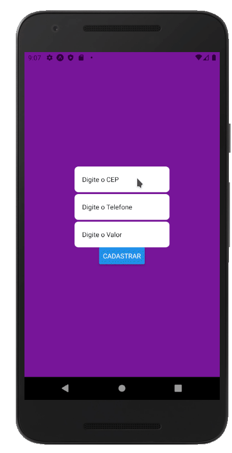

<p align="center">
    
</p>

# 🔖 Sobre

Projeto desenvolvido durante <a href="https://youtu.be/tKZ8ku8ZnW4">esse vídeo</a>.
<br/>
Nesse projeto você poderá ver como criar `input masks` personalizados, de acordo com as necessidades do seu projeto.

Nele utilizamos `regex` para fazer a formatação e validação dos nossos inputs!

## 🗂 Material de apoio

- [React Native](https://reactnative.dev)
- [Expo](https://expo.io)
- [Typescript](https://www.typescriptlang.org/)
- [Typescript no React](https://github.com/typescript-cheatsheets/react-typescript-cheatsheet)
- [Regex](https://developer.mozilla.org/pt-BR/docs/Web/JavaScript/Reference/Global_Objects/RegExp)
- [Testar Regex](https://regexr.com)

## 👍🏻 Como baixar

```bash

    // Clonar repositório
    $ git clone https://github.com/danileao/rn-youtube-inputmask.git

    // Acessar diretório
    $ cd rn-youtube-inputmask

    // Instalar dependências
    $ yarn

    // Iniciar projeto
    $ yarn start
```

---

<p align="center">  
<a target="_blank" href="https://www.youtube.com/danieleleaoevangelista">

</a> &nbsp; &nbsp;

<a target="_blank" href="https://www.instagram.com/dani_leao/">

</a> &nbsp; &nbsp;

<a target="_blank" href="https://twitter.com/danieleleao">

</a> &nbsp; &nbsp;

<a target="_blank" href="https://www.linkedin.com/in/daniele-leão-evangelista-5540ab25/">
 &nbsp;
</a>
</p>
